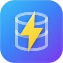

<div align="center">
  
  <h1>react-native-mmkv-storage</h1>
</div>

<div align="center">
    <p><a href="https://www.npmjs.com/package/react-native-mmkv-storage"></a>
<a href="https://www.npmjs.com/package/react-native-mmkv-storage/blob/master/LICENSE"></a>
<a href="https://www.npmjs.com/package/react-native-mmkv-storage"></a>
<a href="https://github.com/ammarahm-ed/react-native-mmkv-storage/actions/workflows/main.yml"></a>
<a href="https://github.com/ammarahm-ed/react-native-mmkv-storage/actions/workflows/ios.yml"></a></p>

</div>

<div align="center">
  <h3>Install the library</h3>
  <pre>npm install react-native-mmkv-storage</pre>
</div>

<div align="center">
  <h3>For expo bare workflow</h3>
  <pre>expo prebuild</pre>
</div>

<div align="center">
    
   <a href="https://rnmmkv.vercel.app/gettingstarted"><h3>Get Started with Documentation</h3></a>
  
</div>

## What it is

This library aims to provide a fast & reliable solution for you data storage needs in react-native apps. It uses [MMKV](https://github.com/Tencent/MMKV) by Tencent under the hood on Android and iOS both that is used by their WeChat app(more than 1 Billion users). Unlike other storage solutions for React Native, this library lets you store any kind of data type, in any number of database instances, with or without encryption in a very fast and efficient way. Read about it on this blog post I wrote on [dev.to](https://dev.to/ammarahmed/best-data-storage-option-for-react-native-apps-42k)

> Learn how to build your own module with JSI on my [blog](https://blog.notesnook.com/getting-started-react-native-jsi/)

## Supported React Native versions

- **New architecture (default since RN 0.76, the only mode since RN 0.82):** requires React Native **0.75 or above**. Tested up to React Native 0.87. Codegen specs are generated at build time by your app, so the library always matches your React Native version.
- **Old architecture:** requires React Native 0.71.0 and above. If you are on an older version of react native, keep using 0.8.x.

## Features

### **Written in C++ using JSI**

Starting from `v0.5.0` the library has been rewritten in C++ on Android and iOS both. It employs React Native JSI making it the fastest storage option for React Native.

### **Simple and lightweight**

(~ 50K Android/30K iOS) and even smaller when packaged.

### **Fast and Efficient**

MMKV uses mmap to keep memory synced with file, and protobuf to encode/decode values to achieve best performance.
You can see the benchmarks here: [Android](https://github.com/Tencent/MMKV/wiki/android_benchmark) & [iOS](https://github.com/Tencent/MMKV/wiki/iOS_benchmark)

### **Reactive using `useMMKVStorage` & `useIndex` Hooks**

Hooks let's the storage update your app when a change takes place in storage.

#### `useMMKVStorage` hook

Starting from `v0.5.5`, thanks to the power of JSI, we now have our very own `useMMKVStorage` Hook. Think of it like a persisted state that will always write every change in storage and update your app UI instantly. It doesn't matter if you reload the app or restart it.

```js
import { MMKVLoader, useMMKVStorage } from 'react-native-mmkv-storage';

const storage = new MMKVLoader().initialize();
const App = () => {
  const [user, setUser] = useMMKVStorage('user', storage, 'robert');
  const [age, setAge] = useMMKVStorage('age', storage, 24);

  return (
    <View style={styles.header}>
      <Text style={styles.headerText}>
        I am {user} and I am {age} years old.
      </Text>
    </View>
  );
};
```

Learn more about `useMMKVStorage` hook it in the [docs](https://rnmmkv.vercel.app/usemmkvstorage).

#### `useIndex` hook

A hook that will take an array of keys and returns an array of values for those keys. This is supposed to work in combination with Transactions. When you have build your custom index, you will need an easy and quick way to load values for your index. useIndex hook actively listens to all read/write changes and updates the values accordingly.

```jsx
import { FlatList, Text } from 'react-native';
import { useIndex, useMMKVStorage } from 'react-native-mmkv-storage';

const App = () => {
  const [postIds] = useMMKVStorage('postsIndex', storage, []);
  const [posts] = useIndex(postIds, 'object', storage);

  return (
    <FlatList
      data={posts}
      keyExtractor={(item, index) => `${index}`}
      renderItem={({ item }) => <Text>{item.title}</Text>}
    />
  );
};
```

Learn more about `useIndex` hook it in the [docs](https://rnmmkv.vercel.app/useindex).

### **Lifecycle Control with Transaction Manager**

Listen to a value's lifecycle and mutate it on the go. Transactions lets you register lifecycle functions with your storage instance such as Read, Write and Delete. This allows for a better and more managed control over the storage and also let's you **build custom indexes** with a few lines of code.

```js
storage.transactions.register('object', 'beforewrite', (key, value) => {
  if (key.startsWith('post.')) {
    const indexKey = `${value.tag}-index`;
    const index = storage.getArray(indexKey) || [];
    storage.setArray(indexKey, [...index, key]);
  }
  return value;
});
```

Learn more about how to use Transactions in [docs](https://rnmmkv.vercel.app/transactionmanager)

### **Multi-Process Support**

MMKV supports concurrent read-read and read-write access between processes. This means that you can use MMKV for various extensions and widgets and your app.

### **Create unlimited Database instances**

You can create many database instances. This helps greatly if you have separate logics/modules in the same app that use data differently, It also helps in better performance since each database instance is small instead of a single bulky database which makes things slower as it grows.

```js
const userStorage = new MMKVLoader().withEncryption().withInstanceID('userdata').initialize();

const settingsStorage = new MMKVLoader().withInstanceID('settings').initialize();
```

### **Full encryption support**

The library supports full encryption (AES CFB-128) on Android and iOS. You can choose to store your encryption key securely for continuious usage. The library uses Keychain on iOS and Android Keystore on android (API 23 and above). Encrypting an instance is simple:

```js
const storage = new MMKVLoader()
  .withEncryption() // Generates a random key and stores it securely in Keychain
  .initialize();
```

And that's it.

### **Simple indexer and data querying**

For each database instance, there is one global key index and then there are indexes of each type of data. So querying is easy and fast.

### **Supports redux-persist**

The instance exposes the `setItem`/`getItem`/`removeItem` shape that redux-persist and zustand expect.

### **Supports expo**

You can use this library with expo [bare workflow](https://docs.expo.dev/workflow/customizing/).

## Consider supporting with a ⭐️ [star on GitHub](https://github.com/ammarahm-ed/react-native-mmkv-storage/)

If you are using the library in one of your projects, consider supporting with a star. It takes a lot of time and effort to keep this maintained and address issues and bugs. Thank you.

## Contact & Support

- Create a GitHub issue for bug reports, feature requests, or questions
- Follow [@ammarahm-ed](https://github.com/ammarahm-ed)

## I want to contribute

That is awesome news! There is a lot happening at a very fast pace in this library right now. Every little help is precious. You can contribute in many ways:

- Suggest code improvements on native iOS and Android
- If you have suggestion or idea you want to discuss, open an issue.
- [Open an issue](https://github.com/ammarahm-ed/react-native-mmkv-storage/issues/) if you want to make a pull request, and tell me what you want to improve or add so we can discuss
- I am always open to new ideas

## Special thanks to

- [ospfranco](https://github.com/ospfranco) and his work on [react-native-quick-sqlite](https://github.com/ospfranco/react-native-quick-sqlite) library which inspired async read/write.

## License

This library is licensed under the [MIT license](https://github.com/ammarahm-ed/react-native-mmkv-storage/blob/master/LICENSE).

Copyright © Ammar Ahmed ([@ammarahm-ed](https://github.com/ammarahm-ed))

#

<a href="https://notesnook.com" target="_blank">

</a>
